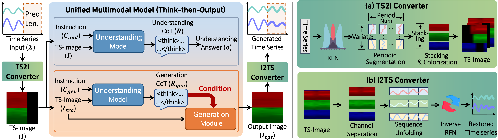
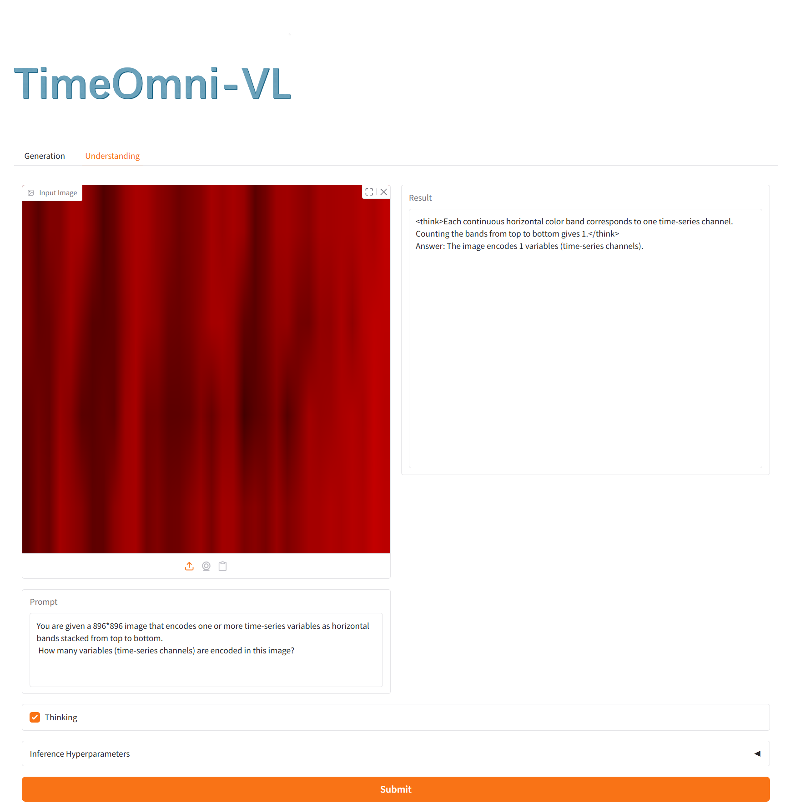
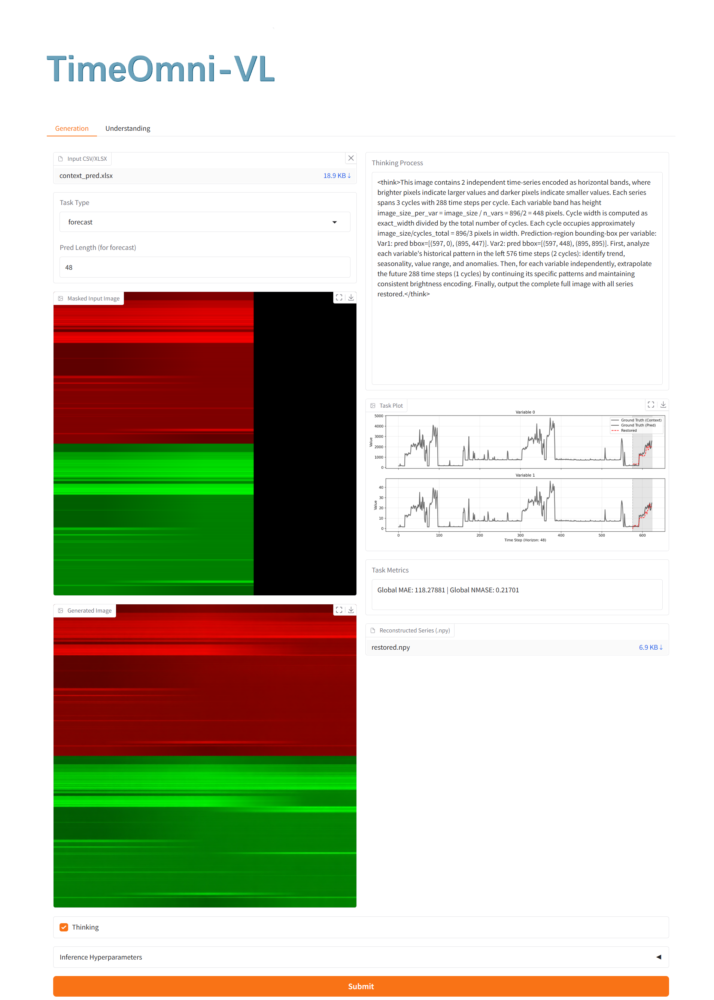
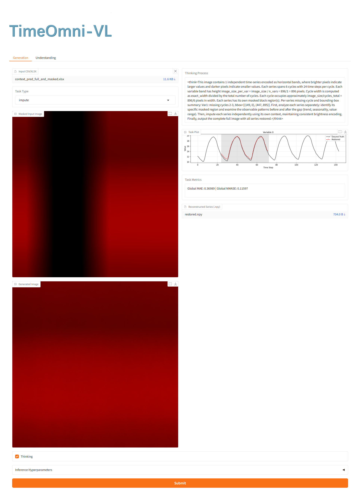

<div align="center">


<h1><b>
TimeOmni-VL: Unified Models for Time Series Understanding and Generation
</b></h1>

<p align="left">
  <a href="https://huggingface.co/TimeOmni-VL/TimeOmni-VL">
    
  </a>
  <a href="https://huggingface.co/datasets/TimeOmni-VL/TSUMM_SUITE_Train">
    
  </a>
  <a href="https://huggingface.co/spaces/TimeOmni-VL/TimeOmni-VL">
    
  </a>
  <a href="https://github.com/AntonGuan/TimeOmni-VL">
    
  </a>
</p>

</div>

**This repository provides model weights, TSUMM-Suite data utilities, training and inference scripts, and evaluation tools for TimeOmni-VL.**


TimeOmni-VL is a vision-centric time-series multimodal model. It represents time series as structured images and supports both time-series understanding and time-series generation in a unified framework.

---

## 🚩 Updates/News

🚩 **News** (May 2026): We release the TimeOmni-VL checkpoint and TSUMM-Suite training samples on Hugging Face: [TimeOmni-VL](https://huggingface.co/TimeOmni-VL/TimeOmni-VL) and [TSUMM_SUITE_Train](https://huggingface.co/datasets/TimeOmni-VL/TSUMM_SUITE_Train).

🚩 **News** (May 2026): TimeOmni-VL has been accepted to ICML 2026.

## 🔎 Overview

<div align="center">

</div>

TimeOmni-VL contains two main components:

1. **TSUMM-Suite**: A data pipeline covering time-series understanding and generation tasks.
2. **TimeOmni-VL**: A unified vision-language generation model trained on time-series images, text instructions, and reasoning data.

## 🛠️ Environment Setup

```bash
# Create a new conda environment
conda create -n timeomni_vl python=3.10
conda activate timeomni_vl

# Install TimeOmni-VL dependencies.
pip install -r training/requirements.txt
```
FlashAttention installation:

```bash
# Download the FlashAttention wheel
wget https://github.com/Dao-AILab/flash-attention/releases/download/v2.5.8/flash_attn-2.5.8+cu122torch2.3cxx11abiFALSE-cp310-cp310-linux_x86_64.whl

# Install FlashAttention
pip install flash_attn-2.5.8+cu122torch2.3cxx11abiFALSE-cp310-cp310-linux_x86_64.whl
```

## 🧱 TSUMM-Suite

TSUMM-Suite includes understanding, generation, and reasoning data.

**Understanding tasks**

- Variable counting
- Variable Y-range identification
- Cycle bounding box localization
- Mean comparison
- Anomaly detection
- Trend analysis

**Generation tasks**

- Multivariate zero-shot time-series forecasting
- Multivariate zero-shot time-series imputation

**Reasoning tasks**

- Text-only time-series reasoning samples that complement the vision-centric tasks.

<div align="center">

</div>

### 🧪 Training Data

The TSUMM-Suite training samples are available at [TSUMM_SUITE_Train](https://huggingface.co/datasets/TimeOmni-VL/TSUMM_SUITE_Train).


### 🧬 Evaluation Data

Before generating evaluation samples, download the [GiftEval data](https://huggingface.co/datasets/Salesforce/GiftEval) into `data_pipeline/GiftEval`, then install the [Gift-Eval Requirements](https://github.com/SalesforceAIResearch/gift-eval):

```bash
git clone https://github.com/SalesforceAIResearch/gift-eval.git && cd gift-eval && pip install -e .
```

The following commands demonstrate how to generate 10 evaluation samples.

Generate forecasting evaluation samples:

```bash
python data_pipeline/gen_test_data/gen_gifteval_forecasting_test.py \
  --output-root data_pipeline/forecast_benchmark_samples \
  --term short medium long \
  --max-total-samples 10
```

Generate imputation evaluation samples:

```bash
python data_pipeline/gen_test_data/gen_gifteval_imputation_test.py \
  --output-root data_pipeline/imputation_benchmark_samples \
  --term short medium long \
  --max-total-samples 10
```

## 🤖 TimeOmni-VL

TimeOmni-VL is a unified vision-language generation model trained on time-series images, text instructions, and reasoning data. It supports time-series forecasting, imputation, visual understanding, and text reasoning through a shared multimodal interface.

### 📦 Model Download

Create a local checkpoint folder and place the downloaded model under it:

```bash
mkdir -p checkpoint
```

Download the TimeOmni-VL checkpoint from [TimeOmni-VL](https://huggingface.co/TimeOmni-VL/TimeOmni-VL).


### 🚀 Inference

Demo-level samples are already included in:

```text
data_pipeline/demo_level_samples/
```


#### 📈 Forecasting

```bash
CUDA_VISIBLE_DEVICES=0 python eval/generation_inference.py \
  --base_model checkpoint/TimeOmni-VL \
  --jsonl data_pipeline/demo_level_samples/forecast_samples_thinking_gen.jsonl \
  --input-root data_pipeline/demo_level_samples \
  --output-root eval/outputs/forecasting_demo \
  --output-name edit.png \
  --metrics-csv eval/outputs/forecasting_demo/metrics.csv \
  --device-ids 0 \
  --no-shuffle
```


#### 🧩 Imputation

```bash
CUDA_VISIBLE_DEVICES=0 python eval/generation_inference.py \
  --base_model checkpoint/TimeOmni-VL \
  --jsonl data_pipeline/demo_level_samples/imputation_samples_thinking_gen.jsonl \
  --input-root data_pipeline/demo_level_samples \
  --output-root eval/outputs/imputation_demo \
  --output-name edit.png \
  --metrics-csv eval/outputs/imputation_demo/metrics.csv \
  --device-ids 0 \
  --no-shuffle
```

#### 👁️ Understanding

```bash
CUDA_VISIBLE_DEVICES=0 python eval/understanding_inference.py \
  --base_model checkpoint/TimeOmni-VL \
  --image data_pipeline/demo_level_samples/sample_understanding/image_full.png \
  --qa-json data_pipeline/demo_level_samples/sample_understanding/qa_pairs.json \
  --qa-index 0 \
  --output-root eval/outputs/understanding_demo \
  --device-ids 0
```

To enable explicit thinking output:

```bash
--think
```

### 🏋️ Training

Dataset configuration:

```text
training/data/configs/example.yaml
```

Training entry:

```bash
bash training/scripts/train.sh
```

Before launching training, update the machine-specific paths, distributed settings, dataset paths, and GPU count in the config and script.

## 🖼️ Demos

**Understanding**

<div align="center">

</div>

**Forecasting**

<div align="center">

</div>

**Imputation**

<div align="center">

</div>


## ✍️ Citation

```bibtex
@article{guan2026timeomni,
  title={TimeOmni-VL: Unified Models for Time Series Understanding and Generation},
  author={Guan, Tong and Pan, Sheng and Barthelemy, Johan and Li, Zhao and Cai, Yujun and Alippi, Cesare and Jin, Ming and Pan, Shirui},
  journal={arXiv preprint arXiv:2602.17149},
  year={2026}
}
```
